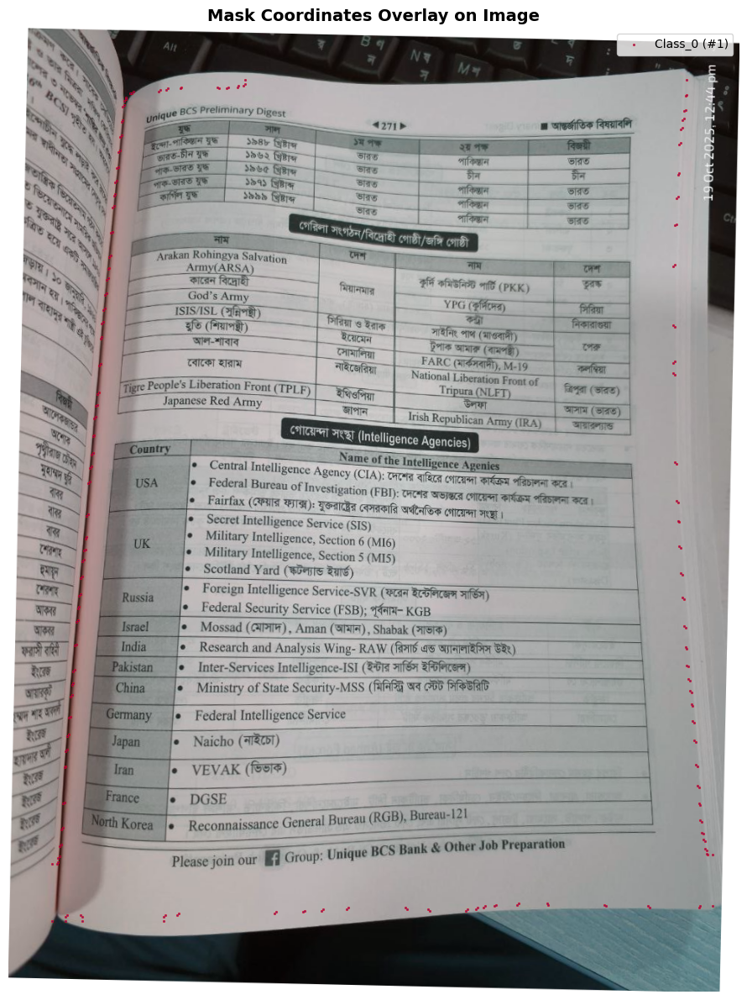
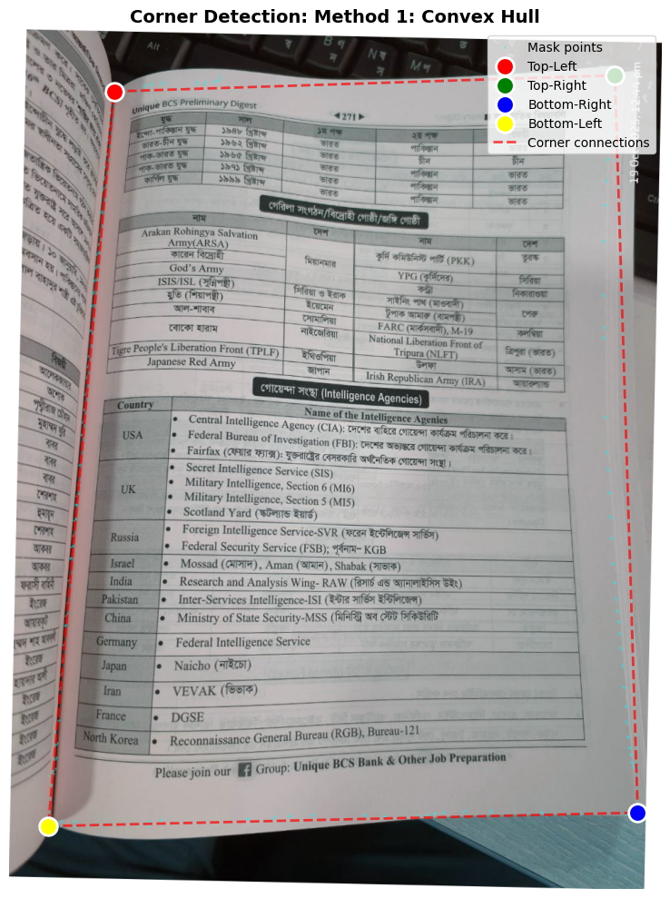
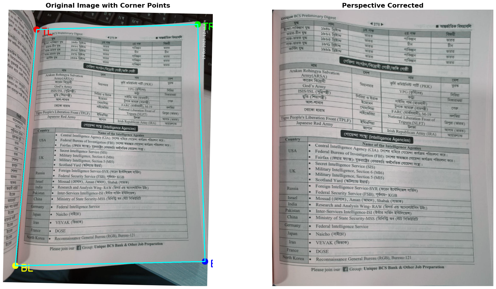

# Page Orientation Correction

**Project summary:**
- This repository contains tools to detect and correct page orientation and perspective for scanned or photographed documents. It detects text-line rotation, finds document corner points using a YOLO-based mask model, corrects perspective, and optionally enhances the resulting image using a super-resolution step.

**Key features:**
- Text-line based rotation detection and correction.
- YOLO-based corner / page-mask detection and polygon extraction.
- Perspective correction using the detected corner points.
- Optional document enhancement / super-resolution before saving.

**Repository structure**
- [requirements.txt](requirements.txt)
- codes/
  - [detect_page_orientation.py](codes/detect_page_orientation.py): Main orchestration script. Loads a YOLO model, detects page corners, performs perspective correction and optional enhancement, and saves outputs.
  - [page_rotation.py](codes/page_rotation.py): Detects text line orientation and rotates images accordingly.
  - [find_corner_point.py](codes/find_corner_point.py): Utilities to derive corner points from mask coordinates (convex hull, polygon approx, visualization helpers).
  - [perspective_transformation.py](codes/perspective_transformation.py): Functions to compute and apply perspective correction given ordered corner points.
  - [filter_img_to_super_res.py](codes/filter_img_to_super_res.py): DocumentEnhancer class to apply super-resolution (scale 2 or 4) and optional pre/post-processing.
  - [test.ipynb](codes/test.ipynb): Interactive notebook (usage/demo exploratory work).
- models/
  - `best.pt`: YOLO model weights used to detect page mask / corners (used by `detect_page_orientation.py`).
- test_img/: Example input images (not committed here).
- output_images/, output_images1/, viz_outputs/: Typical output locations used by scripts.

**Installation**
1. Create a Python environment (recommended):

```bash
python -m venv .venv
source .venv/bin/activate
```

2. Install dependencies:

```bash
pip install -r requirements.txt
```

Notes:
- `ultralytics` / `yolov8` and a compatible PyTorch version are required for `YOLO` model loading. The `requirements.txt` should list compatible versions — adjust PyTorch to match your CUDA/CPU environment.

**Quick usage**
- Run the main script on a single image:

```bash
python codes/detect_page_orientation.py
```

- Example usage from within a Python REPL or another script:

```python
from codes.detect_page_orientation import PageOrientationDetector

model_path = 'models/best.pt'
detector = PageOrientationDetector(model_path, sr=4, apply_enhancement=True)

detector.process_and_save(
    input_path='test_img/some_image.jpg',
    output_dir='output_images',
    save_paths='viz_outputs',
    is_visualize=True,
    conf_threshold=0.3,
    iou_threshold=0.7,
)
```

- Processing a folder (script default behavior):
  - If `input_path` is a directory and `save_paths` is None, the script processes and saves all images in `output_dir`.
  - If `save_paths` is provided while `input_path` is a directory, the script will randomly select one image to save visualizations for (as coded in `process_and_save`).

**Parameters and behavior**
- `PageOrientationDetector(model_path, sr=4, apply_enhancement=True)`
  - `model_path`: path to YOLO weights (e.g., `models/best.pt`).
  - `sr`: super-resolution scale (supported values: 2 or 4). If invalid, enhancement is skipped.
  - `apply_enhancement`: toggles DocumentEnhancer.

- `process_and_save(input_path, output_dir, save_paths=None, is_visualize=False, conf_threshold=0.3, iou_threshold=0.7)`
  - `input_path` can be a single image file or a folder.
  - `save_paths` is used for saving intermediate visualization outputs.
  - `conf_threshold` and `iou_threshold` control YOLO predictions.

**What the pipeline does (high level)**
1. `page_rotation.detect_and_visualize_text_lines()` estimates the rotation angle using detected text lines and returns a rotated/corrected image.
2. YOLO model (`ultralytics.YOLO`) predicts segmentation masks for the page/document region.
3. Mask coordinates (`results.masks.xy`) are used to extract polygon coordinates.
   - `find_corner_point.CornerPointFinder` provides multiple methods to compute corners: convex hull extremes, polygon approximation, etc.
4. The code checks polygon area relative to image area and may switch approximation strategies if the detected polygon is small.
5. `perspective_transformation.correct_perspective_with_points()` is applied to warp the image to a rectangular page.
6. If the detected orientation label is `down`, the image is rotated 180°.
7. Optionally, `filter_img_to_super_res.DocumentEnhancer` applies super-resolution and enhancement.

**Outputs**
- Corrected images are written to the provided `output_dir` with same base filenames.
- Visualization images (when `save_paths` provided) are saved with names like `corrected_page.jpg`, `fliped_corrected_page.jpg`, and a boundary overlay if enabled.

**Demo pipeline (example images)**
Below is an example run of the pipeline using images from this repository to illustrate each step and where the script saves intermediate results.

- **Input image**: 

  ](test_img/photo_6316441238265072545_y.jpg)

- **Step 1 — Rotation detection & correction**: the pipeline estimates the text-line rotation and rotates the image accordingly. Example rotated image (saved by the pipeline):

  - Path: 
  
  ](viz_outputs/rotated_image.jpg)

- **Step 2 — Corner detection & orientation**: the YOLO segmentation model predicts the page mask; corner points are extracted (4 ordered corners) and the model outputs an orientation label (e.g., `up` or `down`). The pipeline will visualize mask points and corner labels when `save_paths` is provided (saved into the visualization folder).
    



- **Step 3 — Perspective transformation**: using the detected corner points the script applies a perspective warp to produce a rectangular, top-down view of the page. The corrected page image is saved to the output directory (for example `corrected_page.jpg` in the viz folder).


- **Step 4 — Super-resolution & enhancement**: the final enhancement (CLAHE, denoise, sharpening and optional Real-ESRGAN upsampling) is applied and the final enhanced image is saved. Example final enhanced image (from this run):

  ](output_images1/photo_6316441238265072549_y.jpg)

Notes:
- The rotated image above was produced by `page_rotation.detect_and_visualize_text_lines()` (the pipeline saves this during the rotation correction step).
- Corner detection is performed by `find_corner_point.CornerPointFinder` (methods include convex hull extremes, polygon approximation, and K-means). Visualizations are saved when `save_paths` is provided to `process_and_save()`.
- The perspective correction function is `perspective_transformation.correct_perspective_with_points()` and saves the corrected page when `save_paths` is set.

Quick example (Python) showing how to run the pipeline and produce the files above:

```python
from codes.detect_page_orientation import PageOrientationDetector

model_path = 'models/best.pt'
detector = PageOrientationDetector(model_path, sr=4, apply_enhancement=True)

# This will: detect rotation -> rotate (saved to temp_output/rotated_image.jpg) -> detect corners & orientation -> correct perspective -> enhance -> save final
detector.process_and_save(
    input_path='test_img/photo_6316441238265072544_y.jpg',
    output_dir='output_images1',
    save_paths='temp_output',
    is_visualize=True,
    conf_threshold=0.3,
    iou_threshold=0.7,
)

# After run you'll find:
# - temp_output/rotated_image.jpg  (rotated image)
# - temp_output/corrected_page.jpg (perspective-corrected visualization)
# - output_images1/<original_name>.jpg (final enhanced image)
```

**Notes & assumptions**
- The repository expects a trained YOLO weights file (`models/best.pt`). If you retrain, ensure the model returns mask segmentation and class labels used by `detect_page_orientation.py` (e.g., class names including `down` and other orientation labels).
- The YOLO results usage assumes segmentation masks are available (`results.masks.xy`). If using a different model/output format, adapt the code accordingly.
- Super-resolution/enhancement code expects OpenCV image arrays (BGR). Be mindful of color order when visualizing with Matplotlib (RGB).

**Filtering & Super-Resolution (detailed)**
This project includes a focused image enhancement pipeline implemented in `codes/filter_img_to_super_res.py` (class `DocumentEnhancer`). Below is a concise description of each processing stage, configurable parameters, and usage notes.

- Implementation reference: `codes/filter_img_to_super_res.py` → `DocumentEnhancer`

- Pipeline stages (order applied by `DocumentEnhancer.enhance()`):
  1. **Contrast enhancement (CLAHE)** — converts the image to LAB color space and applies Contrast Limited Adaptive Histogram Equalization on the L channel to improve local contrast and readability of text.
  2. **Edge-preserving denoising** — uses OpenCV's `fastNlMeansDenoisingColored` to reduce color noise while keeping edges intact.
  3. **Sharpening (Unsharp Mask style)** — applies a Gaussian blur and blends it with the enhanced image (`cv2.addWeighted`) to increase apparent sharpness and improve character edges.
  4. **Text edge enhancement** — creates a binary edge map using adaptive thresholding and blends it with the sharpened image to emphasize strokes and printed text.
  5. **Optional Super-Resolution (Real-ESRGAN)** — if enabled and available, the pipeline converts the image to RGB and calls the Real-ESRGAN upsampler to increase resolution by the chosen scale (`x2` or `x4`) and then converts the result back to BGR.

- Key parameters / how to enable:
  - `apply_sr` (bool): when `True`, the `DocumentEnhancer` attempts to initialize Real-ESRGAN and run the upsampling step. If Real-ESRGAN or its dependencies are missing, the code handles this gracefully and skips SR while still running the other enhancement steps.
  - `sr_scale` (int): supported values are `2` or `4`. Choose `2` for faster runs and lower memory usage; `4` gives stronger upscaling but requires more memory and time.
  - `device` (str): device string passed to the upsampler (for example `'cpu'` or `'cuda:0'`). When using GPU, ensure your environment's PyTorch/CUDA versions are compatible with the Real-ESRGAN package.

- Real-ESRGAN notes and model weights:
  - The code references public Real-ESRGAN weight URLs for x2/x4 models. When the upsampler is initialized it can download weights automatically if not present locally (depending on Real-ESRGAN behavior).
  - If you prefer to provide a local weights file, update the `model_path` when constructing `RealESRGANer` in `filter_img_to_super_res.py`.

- Practical guidance and troubleshooting:
  - If `RealESRGAN` or `basicsr` imports fail, the `DocumentEnhancer` will skip SR and still perform CLAHE/denoise/sharpen steps — this keeps the pipeline usable on minimal setups.
  - For low-memory or CPU-only environments: set `apply_sr=False` and/or `sr_scale=2` to reduce peak memory usage.
  - To test enhancement only, you can call the `process_and_save()` helper in the file (it instantiates a `DocumentEnhancer` and processes a single image or folder). Example:

```python
from codes.filter_img_to_super_res import process_and_save

process_and_save('test_img/photo.jpg', 'enhanced_output', apply_sr=False, sr_scale=2)
```

- Integration with the pipeline:
  - `detect_page_orientation.PageOrientationDetector` creates `DocumentEnhancer` when `apply_enhancement=True` and calls `enhance()` on the final corrected image. The `sr` argument passed into `PageOrientationDetector` is forwarded to the `DocumentEnhancer` as `sr_scale`.

- Performance tips:
  - Run SR on cropped/corrected page images (not full-size originals) to reduce memory/time cost.
  - Use `sr_scale=2` for most document enhancement needs; only use `4` for demanding detail restoration and when GPU memory is available.

**Troubleshooting**
- If `YOLO(model_path)` fails: check `ultralytics` installation and PyTorch CUDA compatibility.
- If polygon detection fails or area is too small: try changing the YOLO confidence (`conf_threshold`) or IoU (`iou_threshold`), or inspect mask coordinates via `plot_mask_coordinates_overlay` in `detect_page_orientation.py`.
- If super-resolution is slow or consumes too much memory: try `sr=2` or disable `apply_enhancement`.

